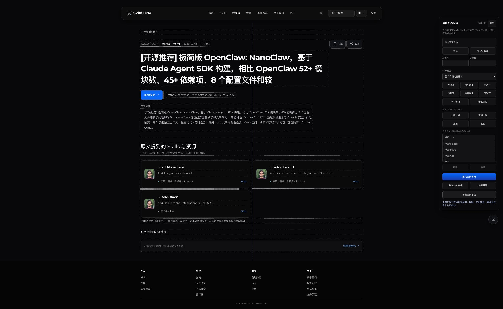

# Visual Layout Editor

[English](README.md) · [简体中文](README.zh-CN.md) · [繁體中文](README.zh-TW.md)

**Drag, align and save layouts in the frontend project you are developing.**

An agent skill that helps your coding agent integrate visual layout controls into a selected region of your real development page. You position the elements yourself; the agent handles integration and validation.

## What it covers

- Drag registered text, buttons, images, decorations and groups; adjust x/y precisely.
- Align to the region, a key element or selection bounds; distribute elements evenly.
- Adjust layer order within valid stacking scopes and select covered objects.
- Save/fix, refresh, re-edit, cancel, undo/redo and export layout JSON.
- Separate desktop/mobile layouts; use English, Simplified Chinese or Traditional Chinese editor labels.

## Scope

Use this with the **current development project and writable page source**. A preview URL locates that project; this is not an arbitrary-website editor, browser extension or hosted drag-and-drop service. Installing the skill does not automatically add controls to every page: your coding agent must integrate them into the selected source page.

Saving in a local editor does not commit code, deploy the site or sync across devices. Source integration is a separate step after you confirm the layout.

## Install

Download this repository as a ZIP. Copy **only** `skills/visual-layout-editor` into your agent's skill directory. For Codex, use `$CODEX_HOME/skills` if configured, otherwise `~/.codex/skills`. Keep the folder name `visual-layout-editor`. Back up an existing version before replacing it. If an active session does not discover it, start a new session and invoke it by name.

The Markdown instructions are portable, but other agents may use different installation paths and discovery mechanisms. Cross-agent compatibility has not been verified.

## Use

Open your development project in your coding agent, then ask:

> Use $visual-layout-editor on the skill-pack detail page we are developing. Make the title, source information and member cards draggable. Let me align elements, adjust layers, save the layout and edit it again. Use English for the editor controls.

Specify a region such as a hero, detail section or card group. Let the agent inspect existing components and add the editor, then arrange the real preview yourself. Ask separately to integrate the confirmed layout into source.

## What was tested

The screenshot is a real SkillGuide skill-pack detail page, with 35 selectable objects. Chrome checks covered drag, region centering, key-element alignment, actual same-parent layer overlap, save/refresh, re-edit/cancel and desktop/mobile persistence isolation.

The trial's layer controls are limited to objects with the same parent. Cross-parent sorting is not implemented in that trial. Real touch hardware, storage-error/conflict recovery and JSON download were not exercised. These are requirements in the skill, not claims of universal tested support.

This release contains skill instructions and references, not the SkillGuide website source or a standalone editor runtime. The screenshot's underlying page remains Chinese; multilingual documentation and requested editor labels do not translate the business page.

## Files

- [Skill](skills/visual-layout-editor/SKILL.md)
- [Interaction and data specification](skills/visual-layout-editor/references/implementation.md)
- [Acceptance paths](skills/visual-layout-editor/references/acceptance.md)
- [Original Chinese instructions](docs/zh-CN/SKILL.md)

Screenshot content belongs to its respective owners; the SkillGuide page is shown as the development integration example. No browser tabs, bookmarks or desktop chrome are included.

## License

Skill instructions and reference specifications are under the [MIT License](LICENSE). The example screenshot, third-party text, logos and avatars retain their respective rights and are excluded from this license grant.
