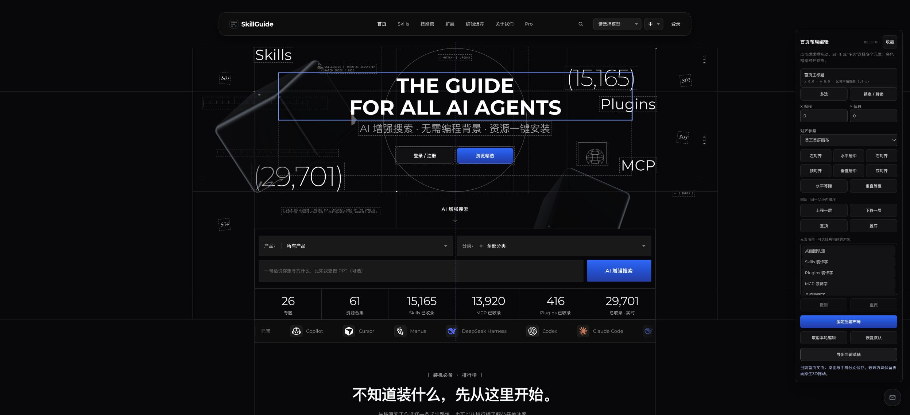
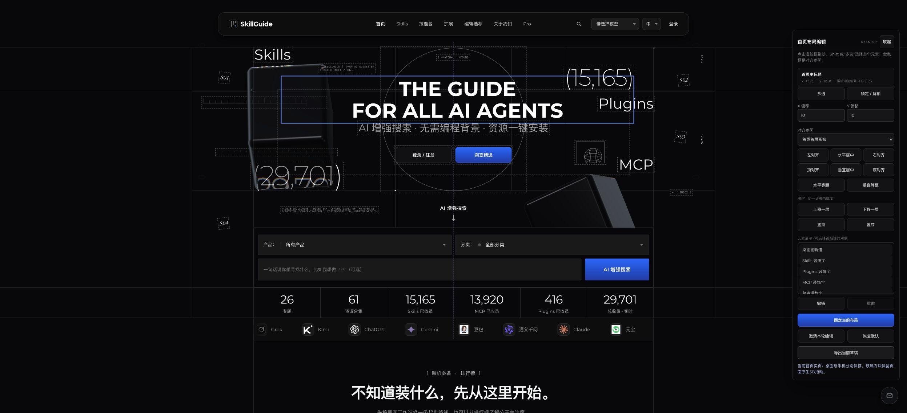
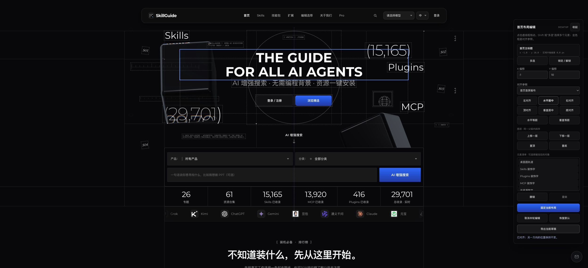

<p align="center">
  <a href="README.md">English</a> · <a href="README.zh-CN.md">简体中文</a> · <a href="README.zh-TW.md">繁體中文</a>
</p>


# 开发中页面布局编辑器

**Agent 把页面做出来，你把元素摆到合适的位置。**

拖动标题、对齐卡片、调整遮挡顺序，保存后还能继续编辑。这个 Skill 让编程 Agent 将这些能力接入**你正在开发的真实前端项目**。

它来自我们开发 **[SkillGuide](https://skillguide.ai/?utm_source=github&utm_medium=readme&utm_campaign=visual_layout_editor)** 时的实际需求。SkillGuide 是我们正在做的 AI Skills、MCP 与 Plugins 发现网站。

**[下载安装包](https://github.com/j19881026/visual-layout-editor-skill/releases/latest)** · **[查看真实演示](#用-skillguide-首页举例)** · **[逛逛 SkillGuide ↗](https://skillguide.ai/?utm_source=github&utm_medium=readme&utm_campaign=visual_layout_editor)**

## 为什么做这个 Skill

开发 SkillGuide 时，最后一点布局调整经常变成新一轮提示词：标题挪一下、按钮居中、卡片放到上面。我们希望直接在页面上把位置摆好，再将确认的结果交给 Agent。

于是把这套开发方式整理成了 Visual Layout Editor：你决定怎么摆，Agent 负责源码接入、保存和验证。

## 用 SkillGuide 首页举例

[](media/homepage-editing-overview.jpg)

**编辑时，页面元素完整露出。** 蓝色框表示选中的标题，虚线框标记可编辑元素，竖线表示画布中轴。完整面板放在首页旁边，和首屏画布间隔 **211.5 px**；对齐、图层、撤销及固定布局按钮都可见，不压住页面内容。

这张图于2026年9月8日直接从 Chrome 的 **2495 × 1138** 视口截取，展示当前开发首页的**真实编辑状态**，保留现有样式。[查看包含页尾的完整长截图](media/homepage-editing-full-page.jpg)。

<details>
<summary>实际操作：拖动标题，再水平居中</summary>



**拖动：** 标题向右、向下各移动10 px，面板显示 x 10、y 10。



**居中：** 实测中轴偏差变为0 px，y保持10。两张图都保留选框、参考线和完整编辑面板。

</details>

这个 Skill 来自开发 SkillGuide 的实际工作。桌面与手机布局可以分别保存；玻璃方块保留首页原生3D交互，面板编辑已登记的页面元素。[查看实测范围和限制](docs/validation.md)。

## 开始使用

### 1. 安装 Skill

在项目中运行 [Skills CLI](https://github.com/vercel-labs/skills) 命令，并选择你的编程 Agent：

```bash
npx skills add j19881026/visual-layout-editor-skill --skill visual-layout-editor
```

也可以直接下载 **[Skill ZIP](https://github.com/j19881026/visual-layout-editor-skill/releases/latest/download/visual-layout-editor-multilingual.zip)**，把其中的 `visual-layout-editor` 文件夹复制到 Agent 的技能目录。Codex 通常使用 `~/.codex/skills`；配置了 `CODEX_HOME` 时使用其 `skills` 子目录。替换旧版前先备份；当前会话未识别时，新开会话调用。

### 2. 指定你正在开发的页面

打开项目源码后，对 Agent 说：

```text
使用 $visual-layout-editor，在当前开发的首页首屏区域接入布局编辑。
标题、副标题、按钮和装饰元素可以拖动，支持相互对齐、图层排序、
固定保存和再次编辑。保留页面现有设计，控件用中文。
打开真实预览，让我自己调整。
```

### 3. 摆放 → 保存 → 继续调整

Agent 找到当前源码页面并复用已有组件接入编辑器。你在真实预览里摆放、固定保存，需要时再次编辑。确定结果后，再要求 Agent 将这版布局固化到源码。

## 能力一览

| 你的需求 | Skill 指导 Agent 实现 |
| --- | --- |
| 精确调位置 | 拖拽、数值偏移、方向键、参考线和锁定。 |
| 让元素对齐 | 六种边缘/居中命令、关键元素或选区参照、等距排列。 |
| 改变遮挡关系 | 上移、下移、置顶、置底，明确显示图层限制。 |
| 反复试方案 | 草稿与固定版本、撤销重做、取消、重置、JSON 导出。 |
| 调手机和桌面 | 不同断点分别保存，避免互相覆盖。 |

## 使用前知道这几件事

**必须有当前项目和可修改的页面源码。** 这是 Agent Skill，由 Agent 在源码中接入控件，不是给任意网址开启编辑的浏览器扩展或在线平台。

| 操作 | 实际含义 |
| --- | --- |
| **固定保存** | 保存到编辑器配置的存储；本机浏览器存储只属于该浏览器及同一来源。 |
| **固化源码** | 另行要求 Agent 将确认布局写入项目 CSS 或配置。 |
| **发布上线** | 走项目已有发布流程。 |

仓库提供指令与参考规范，不包含独立编辑器运行库。当前试用通过了拖拽、对齐、同父级图层和持久化等核心路径，尚未验证全部要求或所有 Agent。**[查看实测范围与限制](docs/validation.md)**。

## 来自 SkillGuide

我们正在做 **[SkillGuide](https://skillguide.ai/?utm_source=github&utm_medium=readme&utm_campaign=visual_layout_editor)**：帮助你发现 AI Skills、MCP 和 Plugins，并找到它们的原始出处。这个 Skill 就是从网站开发中提炼出来的。

**[打开 SkillGuide →](https://skillguide.ai/?utm_source=github&utm_medium=readme&utm_campaign=visual_layout_editor)** · [发现 Skills](https://skillguide.ai/zh/skills) · [查看技能包](https://skillguide.ai/zh/packs)

如果对你有帮助，欢迎 Star；接入时遇到问题，可以[提交 Issue](https://github.com/j19881026/visual-layout-editor-skill/issues)，说明框架、目标区域和期望行为。

<details>
<summary><strong>开发者资料：实现规范与验收路径</strong></summary>

- [Skill 入口](skills/visual-layout-editor/SKILL.md)
- [中文指令](docs/zh-CN/SKILL.md)
- [交互与数据规范](docs/zh-CN/references/implementation.md)
- [真实浏览器验收](docs/zh-CN/references/acceptance.md)

保留原页面的设计与业务行为；检查实际坐标、遮挡、保存刷新和再次编辑，不能只凭菜单文案验收。

</details>

## 许可

Skill 指令与参考规范使用 [MIT](LICENSE)。截图与第三方内容保留各自权利，不在此许可授权范围内。
