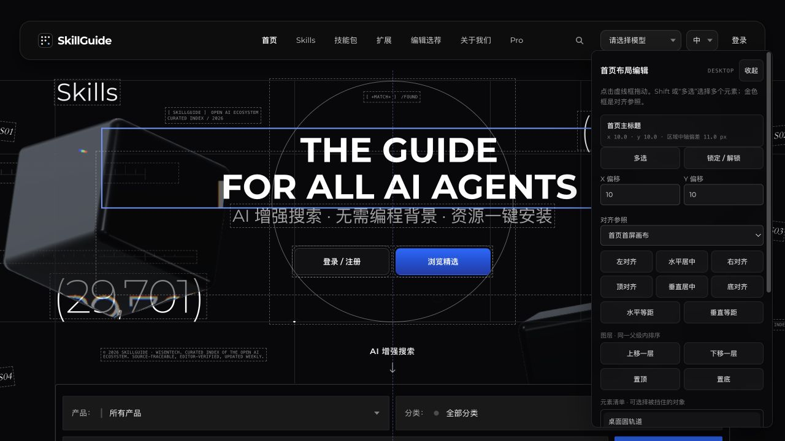
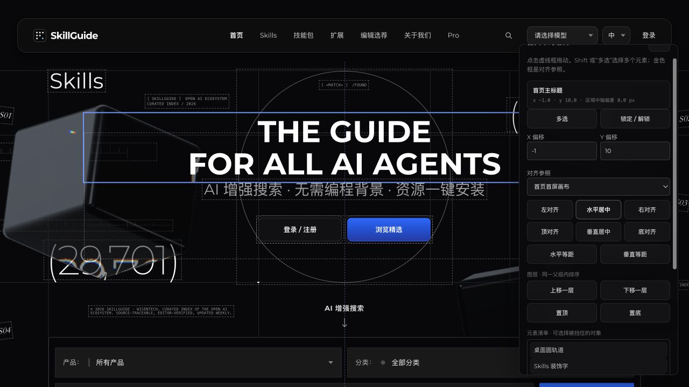
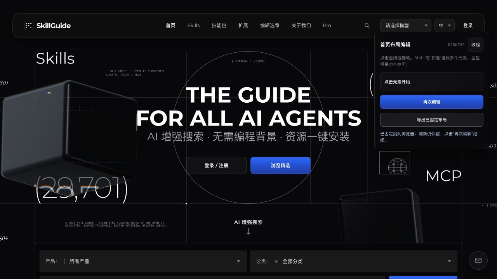
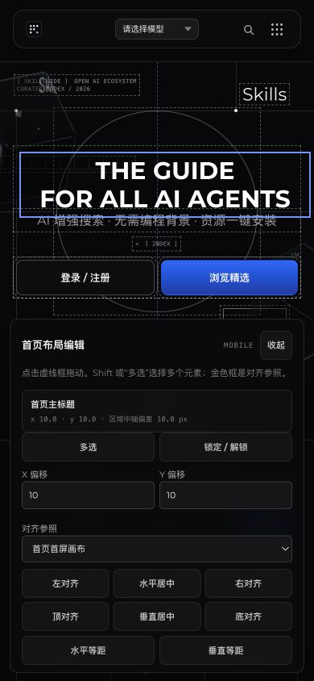
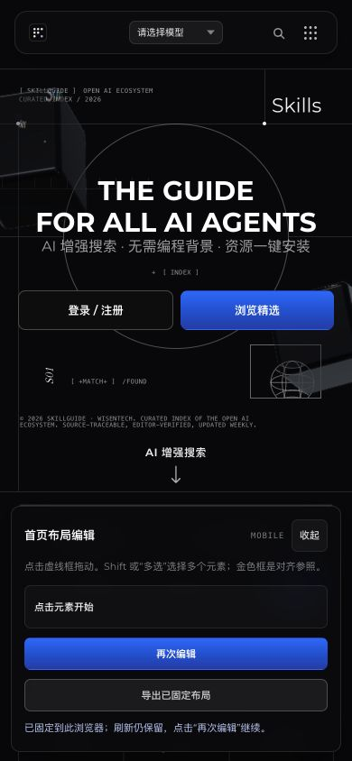

<p align="center">
  <a href="README.md">English</a> · <a href="README.zh-CN.md">简体中文</a> · <a href="README.zh-TW.md">繁體中文</a>
</p>


# 開發中頁面版面編輯器

**Agent 把頁面做出來，你把元素放到合適的位置。**

拖曳標題、對齊卡片、調整遮擋順序，儲存後還能繼續編輯。這個 Skill 讓程式開發 Agent 將這些能力加入**你正在開發的真實前端專案**。

它來自我們開發 **[SkillGuide](https://skillguide.ai/?utm_source=github&utm_medium=readme&utm_campaign=visual_layout_editor)** 時的實際需求。SkillGuide 是我們正在打造的 AI Skills、MCP 與 Plugins 探索網站。

**[下載安裝包](https://github.com/j19881026/visual-layout-editor-skill/releases/latest)** · **[查看真實示範](#以-skillguide-首頁為例)** · **[探索 SkillGuide ↗](https://skillguide.ai/?utm_source=github&utm_medium=readme&utm_campaign=visual_layout_editor)**

## 為什麼做這個 Skill

開發 SkillGuide 時，最後一點版面調整常常變成新一輪提示詞：標題挪一下、按鈕置中、卡片放到上層。我們希望直接在頁面上擺好位置，再把確認結果交給 Agent。

於是把這套開發方式整理成了 Visual Layout Editor：你決定如何擺放，Agent 負責原始碼整合、儲存與驗證。

## 以 SkillGuide 首頁為例

[](media/homepage-desktop-drag.jpg)

**桌面端：直接移動目前首頁標題。** 圖中標題透過真實滑鼠操作**向右、向下各移動10 px**，選框與面板座標同步變化。導覽、字型、玻璃動畫及按鈕均來自目前開發頁面。

<details>
<summary>標題置中，再固定儲存與再次編輯</summary>



**水平置中：** 實測中軸偏差變為 **0 px**，縱向位移維持10 px。



**固定儲存：** 選框隱藏，點擊**再次編輯**即可繼續調整。儲存後重新整理及取消編輯均在瀏覽器中核驗。

</details>

### 行動版：實際響應式首頁

<p>
  
  
</p>

**左圖：** 真實 **390 × 844瀏覽器視窗**中，標題向右、向下各拖曳10 px。**右圖：** 置中並固定後，提供**再次編輯**入口。直接使用首頁響應式版面，已移除舊的固定手機畫布外框。

截圖來自 **2026年9月8日執行中的 SkillGuide 開發首頁**。編輯器整合至既有原始碼，頁面與面板皆為真實介面，沒有生成或合成UI。桌面與手機版面分別儲存；玻璃方塊保留首頁原生3D互動，版面面板編輯已登記的頁面元素。[查看具體實測範圍](docs/validation.md)。

## 開始使用

### 1. 安裝 Skill

在專案中執行 [Skills CLI](https://github.com/vercel-labs/skills) 指令，選擇你的程式開發 Agent：

```bash
npx skills add j19881026/visual-layout-editor-skill --skill visual-layout-editor
```

也可以直接下載 **[Skill ZIP](https://github.com/j19881026/visual-layout-editor-skill/releases/latest/download/visual-layout-editor-multilingual.zip)**，把 `visual-layout-editor` 資料夾複製到 Agent 技能目錄。Codex 通常使用 `~/.codex/skills`；設定 `CODEX_HOME` 時使用其 `skills` 子目錄。替換前先備份舊版；目前工作階段未辨識時，開啟新的工作階段呼叫。

### 2. 指定正在開發的頁面

開啟專案原始碼後，告訴 Agent：

```text
使用 $visual-layout-editor，在目前開發的首頁首屏區域加入版面編輯。
標題、副標題、按鈕與裝飾元素可以拖曳，支援相互對齊、圖層排序、
固定儲存與再次編輯。保留既有設計，控制項使用繁體中文。
開啟真實預覽，讓我親自調整。
```

### 3. 擺放 → 儲存 → 繼續調整

Agent 找到目前原始碼頁面並重用既有元件加入編輯器。你在真實預覽中擺放、固定儲存，需要時再次編輯。確認結果後，再要求 Agent 將版面寫入原始碼。

## 能力一覽

| 你的需求 | Skill 指導 Agent 實作 |
| --- | --- |
| 精確調整位置 | 拖曳、數值位移、方向鍵、參考線與鎖定。 |
| 讓元素對齊 | 六種邊緣/置中指令、關鍵元素或選區參照、等距排列。 |
| 改變遮擋關係 | 上移、下移、最上層、最下層，明確顯示圖層限制。 |
| 反覆嘗試方案 | 草稿與固定版本、復原重做、取消、重設、JSON 匯出。 |
| 調整手機與桌面 | 各斷點分別儲存，避免互相覆蓋。 |

## 使用前須知

**必須有目前專案與可修改的頁面原始碼。** 這是 Agent Skill，由 Agent 在原始碼中加入控制項，不是讓任意網址都可編輯的瀏覽器擴充功能或線上平台。

| 操作 | 實際含義 |
| --- | --- |
| **固定儲存** | 儲存到編輯器設定的儲存空間；本機瀏覽器儲存屬於該瀏覽器與同一來源。 |
| **寫入原始碼** | 另行要求 Agent 將確認的版面寫入專案 CSS 或設定。 |
| **部署上線** | 遵循專案既有發布流程。 |

儲存庫提供指令與參考規格，不包含獨立編輯器執行程式。目前試用通過拖曳、對齊、同父層圖層與持久化等核心路徑，尚未驗證全部要求或所有 Agent。**[查看實測範圍與限制](docs/validation.md)**。

## 來自 SkillGuide

我們正在打造 **[SkillGuide](https://skillguide.ai/?utm_source=github&utm_medium=readme&utm_campaign=visual_layout_editor)**：協助你發現 AI Skills、MCP 與 Plugins，並找到它們的原始出處。這個 Skill 就是從網站開發中整理出來的。

**[開啟 SkillGuide →](https://skillguide.ai/?utm_source=github&utm_medium=readme&utm_campaign=visual_layout_editor)** · [探索 Skills](https://skillguide.ai/zh/skills) · [查看技能包](https://skillguide.ai/zh/packs)

如果對你有幫助，歡迎 Star；整合時遇到問題，可以[提出 Issue](https://github.com/j19881026/visual-layout-editor-skill/issues)，說明框架、目標區域與預期行為。

<details>
<summary><strong>開發者資料：實作規格與驗收路徑</strong></summary>

- [Skill 入口](skills/visual-layout-editor/SKILL.md)
- [英文互動與儲存規格](skills/visual-layout-editor/references/implementation.md)
- [真實瀏覽器驗收](skills/visual-layout-editor/references/acceptance.md)
- [簡體中文原始規格](docs/zh-CN/SKILL.md)

保留原頁面的設計與業務行為；檢查實際座標、遮擋、儲存後重新整理及再次編輯，不能只憑選單文案驗收。

</details>

## 授權

Skill 指令與參考規格使用 [MIT](LICENSE)。截圖與第三方內容保留各自權利，不在此授權範圍內。
